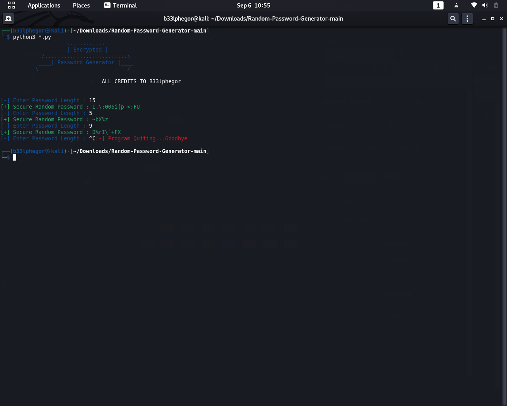

# Random-Password-Generator

# 

- Description
-------------
	Random Password Generator is a python3 tool
	that use's ascii_letter'ss, punctuation's and
	number's to generate truly secure random 
	passwors using the user's length input to
	set the leng of the password.

- Installation
--------------
	[0] pip3 install -r requirements.txt
	
- Usage
------
	[0] python3 __main__.py
	[1]	Enter Length Of Password : 18
	[2] Enter Password Length :18
	[+] Secure Random Password : &3/[I:>fgV!sJ@Rh:X

- Authors
---------
	- Moobi K.Ceejay (giftmoobi@gmail.com)
